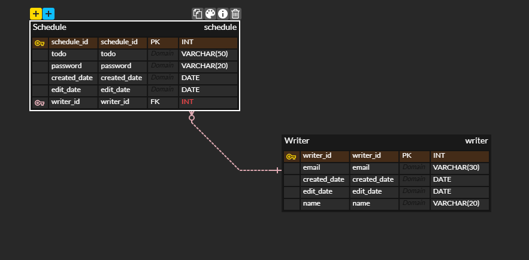

# API 명세서
|    기능    | Method |             URL             | request  | response | 상태코드
|:--------:|:------:|:---------------------------:|:--------:|:--------:|:---:|
|  일정 등록   |  POST  |       /api/schedules        | 요청 body  |  등록 정보   | 201: 정상등록 |
|  일정 조회   |  GET   | /api/schedules/{scheduleId} | 요청 param | 단건 응답 정보 | 200: 정상조회
| 일정 목록 조회 |  GET   |       /api/schedules        | 요청 param | 다건 응답 정보 | 200: 정상조회
| 일정 목록 조회 |  PUT   | /api/schedules/{scheduleId} | 요청 body  |  수정 정보   | 200: 정상수정
| 일정 목록 조회 | DELETE | /api/schedules/{scheduleId} | 요청 param |    -     | 200: 정상삭제

# ERD

